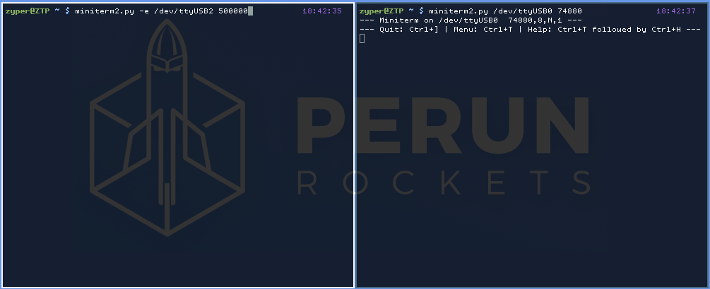

# Perun LoRa (Arduino)

Repository consists of two projects:
- PERUN_ROCKET
- PERUN_BASE

#### Pinout
LoRa pins can be changed in [LoRa_Base.ino](PERUN_BASE/LoRa_Base.ino) file (for PERUN_BASE) and [LoRa_Rocket.ino](PERUN_ROCKET/LoRa_Rocket.ino) (for PERUN_ROCKET). LoRa SPI pins (SCK, MOSI, MISO) should be connected to corresponding SPI pins on the Arduino board (usually respectively 18,23,19 for ESP32 boards).
`LORA_SS_PIN` - Slave Select pin. `LORA_RESET_PIN` - LoRa reset pin.

`startLoRa` function initializes LoRa radio with specified hardcoded frequency on specified hardcoded pins

#### Data packet
Before any data there should be `LORA_PACKET_MAGIC` string to make sure we are not processing garbage.

Types of data:
- `LORA_PACKET_TELEMETRY_TYPE (0x01)`     Telemetry from the rocket
- `LORA_PACKET_STATUS_TYPE    (0x02)`     Status of the rocket
- `LORA_PACKET_COMMAND_TYPE   (0xA1)`     Command from the base

***

## PERUN ROCKET

Sends telemetry to the base and listens to commands.

Functions:
 - `sendTelemetry` - (based on logTelemetry from [SDlog.ino](https://github.com/perunrockets/perun-telemetry-arduino/blob/master/PERUN/SDlog.ino#L23)) sends telemetry
 - `sendStatus` - sends current rocket status (temporary: int STAT from [PERUN_ROCKET.ino](https://github.com/perunrockets/perun-lora-arduino/blob/master/PERUN_ROCKET/PERUN_ROCKET.ino#L23))
 - `parseLoRaData` - parses packet and executes commands (eg. [ignition function](https://github.com/perunrockets/perun-lora-arduino/blob/master/PERUN_ROCKET/LoRa_Rocket.ino#L172) or [parachute deployment function](https://github.com/perunrockets/perun-lora-arduino/blob/master/PERUN_ROCKET/LoRa_Rocket.ino#L178))
***

## PERUN BASE

Sends commands from Serial and receives telemetry from the rocket.

LoRa_Base functions:
  - `sendCommand` - sends (binary) command to the rocket (`LORA_START_CMD_CODE(0x41)` for ignition, `LORA_DEPLOY_CMD_CODE(0x42)` for parachute deployment)
  - `parseLoRaData` - parses PR packet and prints received telemetry or rocket status

Perun_SerialCmd functions:
  - `executeCommand` - executes specified function based on data received from Serial
  - `checkForCommand` - checks if there are any commands on Serial

### Available commands:
- `PR`        (should print "OK\n")
- `PR+START`  (starts rocket)
- `PR+DEPLOY` (deploys parachute) 
- `PR+LORA` 	(dumps LoRa registers)
***

All functions save data to Stream specified as an argument (eg. Serial or SD).
***

Live demo of actual working modules (left: Base; right: Rocket).

#### Libraries
Code uses [Arduino LoRa library](https://github.com/sandeepmistry/arduino-LoRa), which is licensed under the MIT Licence.

